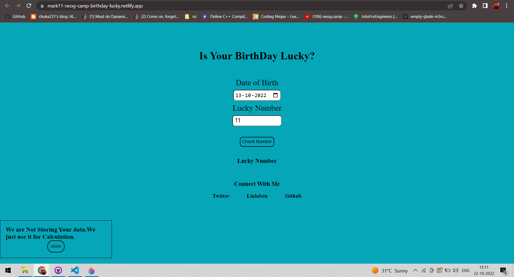

# Is your birthday lucky?
## About
- User has to select birthday and a lucky number.
- The application finds out if sum of digits of birthday is divisible by the lucky number. If divisble, it's a lucky number and vice versa.
- Result shown to user if entered birthday is lucky or not.
- Also , there is a privacy notice showing that we are not storing data from the user.

## Tech-Stack used:
1. HTML
2. CSS
3. JavaScript
4. Netlify(for deployment)

